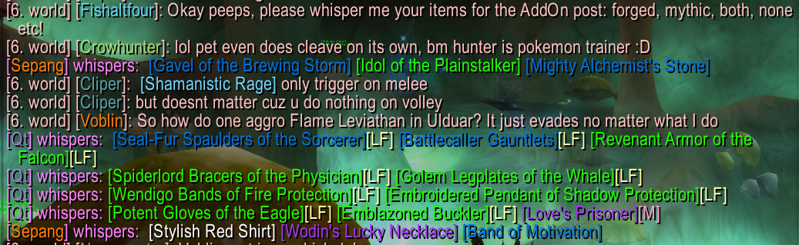
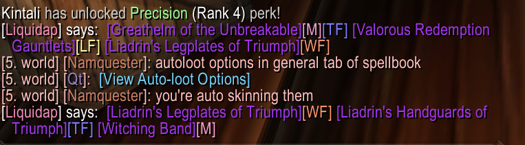

# ForgedItemLinks

**ForgedItemLinks** is a lightweight Synastria addon that allows you to **add coloured [Tags] after linked forged and Mythic items in chat.**.

---

## 🔧 Features

- Automatically adds an M tag after Mythic items linked in chat.
- Automatically adds TF, WF, and LF tags after Titanforged, Warforged and Lightforeged items linked in chat.

---

## 📦 Installation

1. Download or clone this repository.
2. Move the `ForgedItemLinks` folder into your WoW AddOns directory:

   ```
   Synasatria/Interface/AddOns/
   ```

3. Restart the game or run `/reload`.

---

## 📸 Screenshots

 
  

---


## 📜 License

GPL-3.0 license

---
